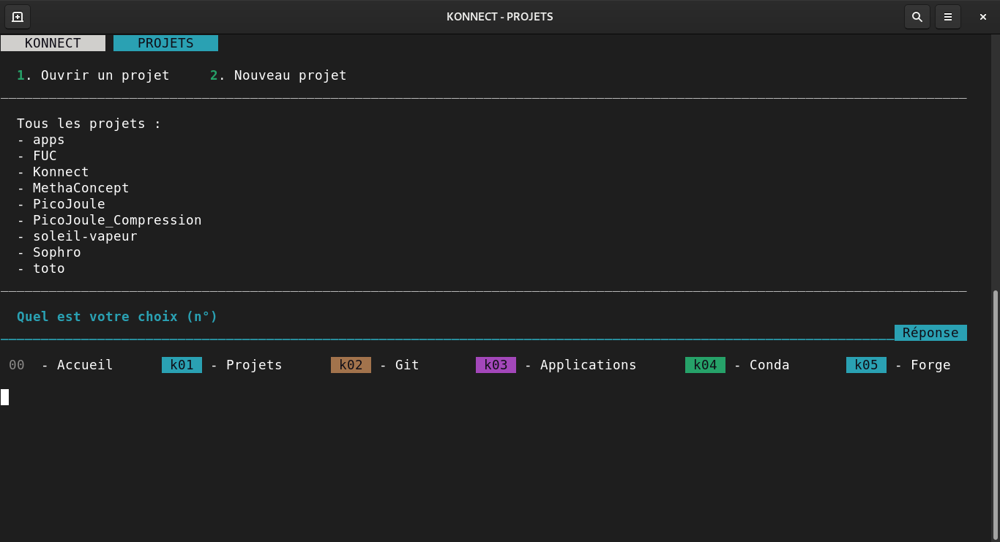
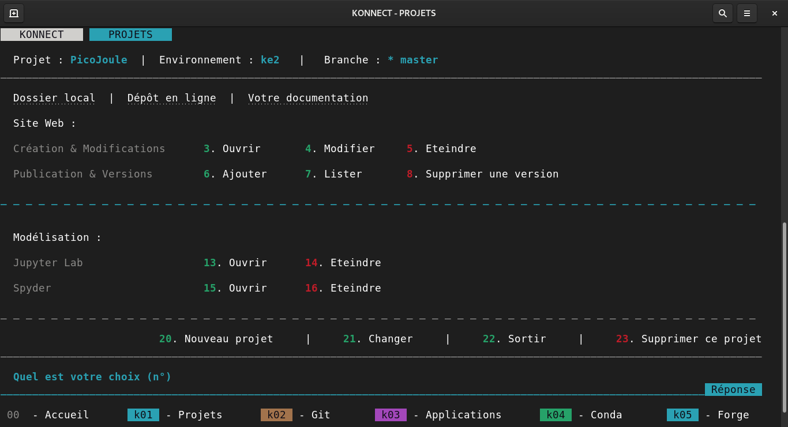
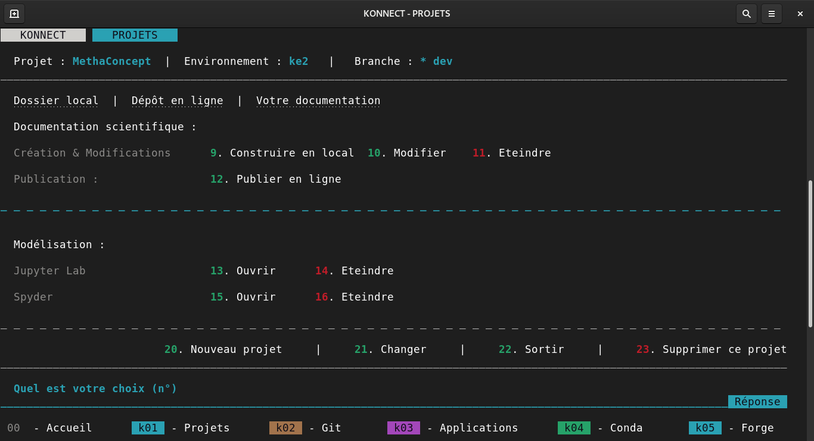
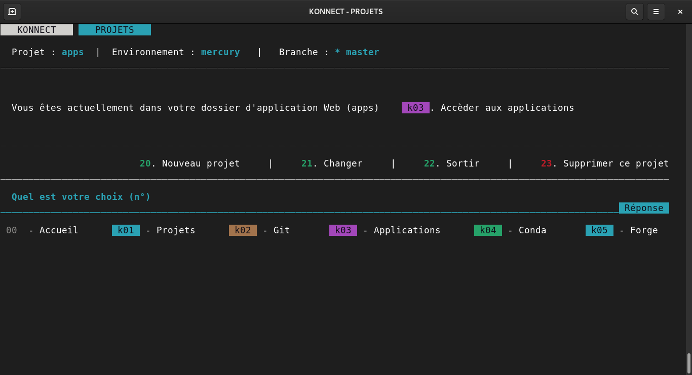
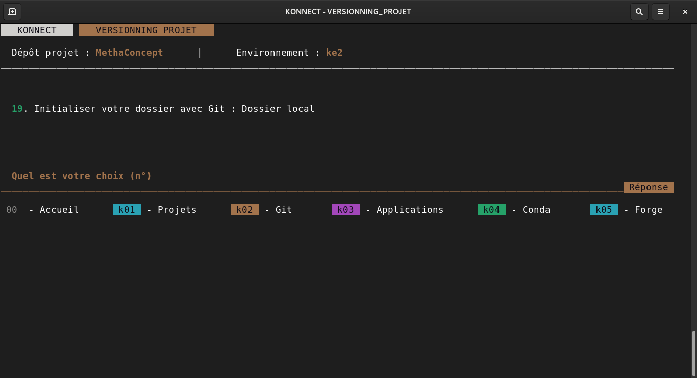
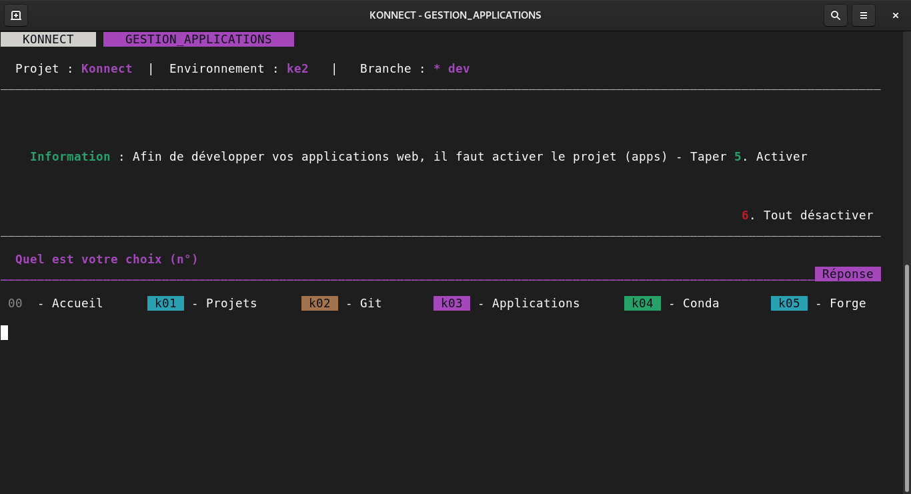
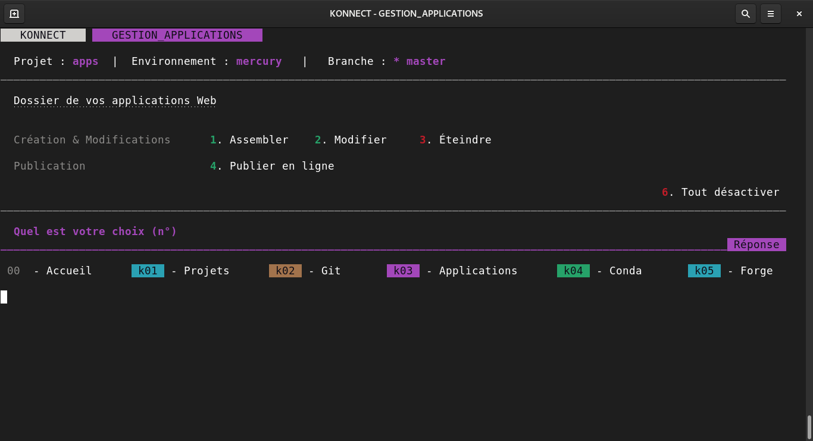
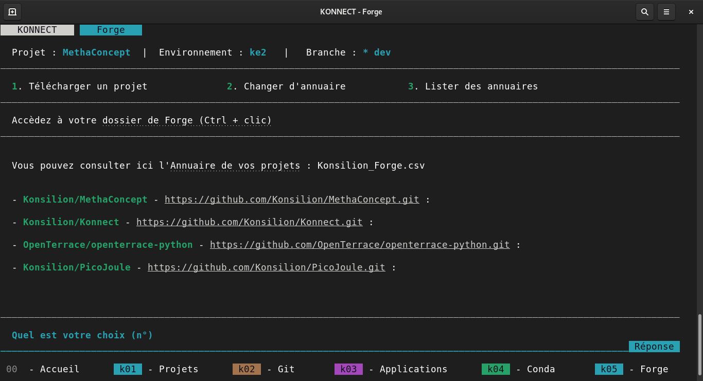

# **Les différentes interfaces** de Konnect

!!! warning "Page en construction"

    Les informations présentes sur cette page ne sont peut être pas à jour. Ainsi nous vous recommandons de les lire avec attention, pour ne pas faire de mégardes.

??? info "Description des commandes"

    * **1**. Toutes les fonctionnalités concernant la documentation et modélisation
    * **2**. Versionner et Partager votre projet sur GitHub
    * **3**. Développer vos applications Web avec Mercury
    * **4**. Créer et modifier vos environnements avec la technologie Conda
    * **5**. La Forge facilite le partage de vos annuaires de projets dans l'idée d'un intranet distribué
    * **6**. Paramètres de Konnect

---

## Documentation et Modélisation

*Vous n'avez pas de projet sélectionné dans Konnect.* 

??? info "Description des commandes"

    * **1**. Pour ouvrir un projet enregistré
    * **2**. Créer un projet depuis zéro avec Konnect

---

*Le projet séléctionné (ici PicoJoule) comporte une documentation de* ***type Site Web***

??? info "Description des commandes"

    * **3** - Visualiser la documentation en local à l'[addresse suivante](http://localhost:8000)
    * **4** - Modifier la documentation avec Jupyter Lab
    * **5** - Eteindre la documentation et libérer le port 8000
    * **6** - Ajouter votre version locale à votre documentation en ligne 

---

*Le projet séléctionné (ici MethaConcept) comporte une documentation de* ***type Documentation scientifique***

??? info "Description des commandes"

    * **9** - Visualiser la documentation en local
    * **10** - Modifier la documentation avec Jupyter Lab
    * **11** - Eteindre la documentation et libérer le port 8000
    * **12** - Remplacer votre version en ligne par votre documentation en locale 

---

*Le projet sélectionné actuellement est* ***apps*** *ainsi il vous faut taper k03 afin d'accèder à la gestion de vos applications Web.*

??? info "Description des commandes"

    * **21** - Changer pour un projet autre que 'apps'
    * **k03** - Passer sur la page des applications afin de travailler sur vos applications web

## Versionning projets

*Le projet sélectionné est actuellement* ***hors-ligne*** *, et présent uniquement sur votre PC.*

??? info "Description des commandes"

    * **21** - Changer pour un projet autre que 'apps'
    * **k03** - Passer sur la page des applications afin de travailler sur vos applications web

---

*Le projet sélectionné possède une gestion* ***git***

!!! warning "Votre projet est-il en ligne ?"

    Pour savoir si votre projet est en ligne, regardez s'il y a dans Konnect un lien Dépôt en ligne à côté de Dossier local
    
    Si ce n'est pas le cas, nous vous recommandons de taper 1. Ainsi vous accèdez aux fonctionnalités de Konnect de partage en ligne de vos projets.

??? info "Description des commandes"

    * **1** - Envoyer votre projet en ligne sur GitHub
    * **2** - Consulter vos informations Git et GitHub liées à votre compte actuel
    
    ---
    
    * **3** - Consulter les différentes branches de travail de votre projet
    * **4** - Changer de branche de travail
    * **5** - Ajouter une branche afin d'intégrer un nouveau développement
    * **6** - Rétirer la branche actuelle sur votre copie locale (à supprimer sur GitHub également)
    
    ---
    
    * **7** - Afficher les modifications locale non enregistrées sur votre git locale
    * **8** - Ajouter vos modifications afin qu'elles soient prises en compte pour votre prochain envoi en ligne
    * **9** - Cloturer vos modifications en locale, et indiquer un commentaire afin d'identifier cette sauvegarde (c'est un nouveau commit)
    * **10** - *Non disponible*
    
    ---
    
    * **11** - Envoyer vos modifications sur le dépôt en ligne (envoi de tous vos commits)
    * **12** - Consulter vos différents commits (ceux de la commande 9) afin d'avoir l'historique de votre projet (taper q pour quitter)
    * **13** - Importer les éventuelles modification effectuées par d'autres, depuis le dépôt en ligne, sur votre branche actuelle.
    
    ---
    
    * **14** - Lister vos différents paramètres
    * **15** - Quitter le projet en cours
    * **16** - Déconnecte votre dossier local du dépôt distant.

    

## Gestion des applications Web

---

## Environnement de développement

## Forge

