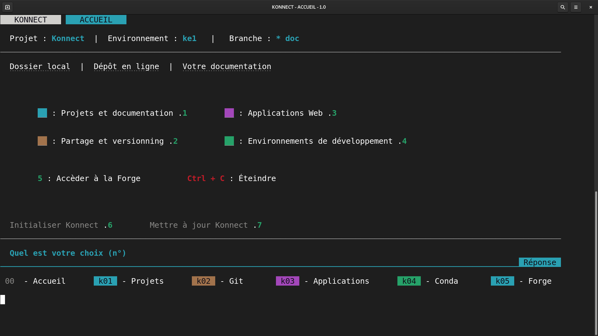

---
hide:
    - toc
---

# **Installer Konnect sur votre PC**

???+ tip "Astuces pour le terminal"

    * Pour ouvrir un terminal : **clic droit depuis le dossier cible**, et ouvrir Terminal.
    * Dans le terminal **la souris ne marche pas**, il faut **utiliser les flèches**
    * Les raccourcis comme copier, coller sont différents. Ainsi **préferer le clic droit souris** pour voir les options disponibles.

---

Télécharger le [**fichier d'installation**](https://konsilion.nohost.me/nextcloud/s/DrQQe3W2ysy49D3){target=} dans l'emplacement où vous souhaitez installer Konnect :
    
* Ouvrir un terminal dans ce **même emplacement**
* Taper la commande suivante : `. install.sh` (le point du début est important)

Ensuite il vous faut suivre les différentes instruction. 

`Si vous arrêtez l'installation en cours, alors supprimez le dossier Konnect éventuellement créé et recommencez l'installation par la suite.`

---

!!! success "Etape 1/2 - Installation de Konnect terminée"
    
    **Une bonne chose de faite**, vous avez maintenant votre maison numérique Konnect. **Mais il est essentiel** que vous meubliez cette maison, il s'agit de **votre environnement**.

## Finalisation des environnements

Désormais, il vous faut **créer deux environnements**, pour ça :

* Dans Konnect, taper la commande `k04`
* Puis `11` afin de lancer la création des environnements de Konnect 

??? info "De quels environnements parlons nous ?"

    === "Les bases de Konnect"

        L'environnement suivant vous **assure le minimum** pour utiliser les services de Konnect.

        * **Nom de l'environnement** : `ke1`
        * **Cannal favoris** : `conda-forge`
        * **Packages** : `gh spyder jupyter jupyterlab nodejs mkdocs mkdocs-material mkdocs-macros-plugin mike jupyter-book`

    === "Applications Web"

        L'environnement suivant vous permet de **créer des applications Web** avec le logiciel Mercury.

        * **Nom de l'environnement** : `mercury`
        * **Cannal favoris** : `conda-forge`
        * **Packages** : `mercury jupyterlab nodejs`
        

---

Après l'installation des deux environnements, **profiter pleinement** des [fonctionnalités de Konnect](../../fonctionnalites/interfaces). 

!!! success "Etape 2/2 - Konnect est prêt à l'emploi !"

 

