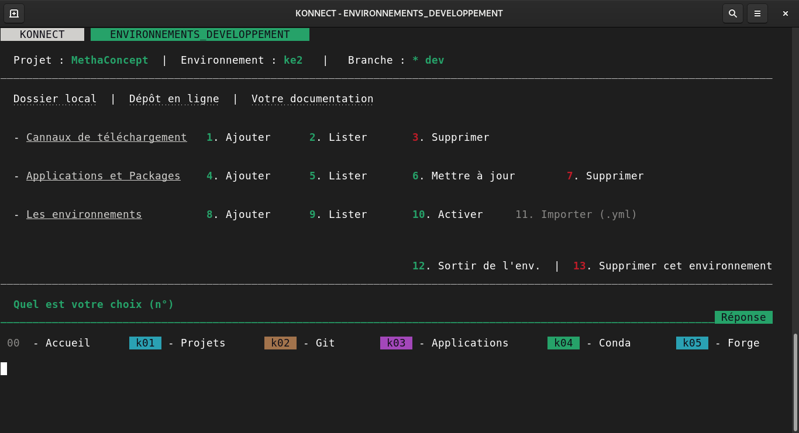

---
hide:
    - toc
---

# **Création d'environnement**

Un environnement c'est un peu comme un **petit ordinateur virtuel et indépendant**, au sein de votre ordinateur. Ainsi vous pouvez **compartimenter l'installation de vos packages** au sein d'environnement distinct.

---

??? info inline end "Ajouter Conda Forge"

    Les canaux de téléchargement sont des **annuaires pour les applications de conda**. Le canal `conda-forge` est un des plus populaires, et Konnect repose en grande partie sur ce dernier. [Ajouter un canal](../ajout_channel)
   

* Commencez par [démarrer Konnect]()
* Ensuite accèdez aux environnements en tapant `k04`
* Et enfin taper `8`

C'est tous, après il suffit juste de **suivre les instructions**. Pour débuter vous pouvez créer un environnement avec uniquement `python` et aucun package de renseignés. 
Par la suite, vous pourrez [ajouter des packages](../ajout_package) selon vos différents [cannaux de téléchargement](../ajout_channel).

!!! tip "Quelques bonnes pratiques"

    - Ajouter **conda-forge**
    - Ne pas avoir (trop) de **programme en fond** lors de la création de l'environnement,
    - Avoir une **connexion internet convenable** 
    - Ne **pas installer trop de packages d'un coup**. Il est possible de construire un environnement **package par package**, cela dépend de la puissance de votre ordinateur.

---

  
