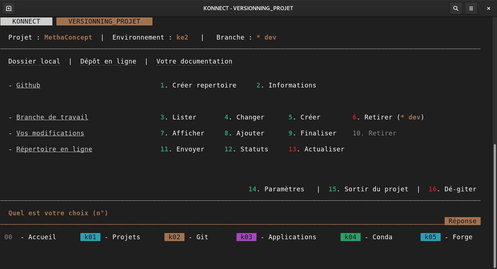

---
hide:
---

# **Compartimenter votre projet**

---

!!! warning inline "Version bêta"

    Actuellement l'intégration de git à Konnect n'est pas terminée. Ainsi nous vous recommandons de **suivre ces quelques instructions**.

Lorsque vous travailler sur un projet, il est recommandé de le **compartimenter en branches**, où la branche dite **master** représenterait le tronc.

La branche master est celle qui présente la **version à stable** de votre projet, celle à diffuser au grand public.

---

Voici comment **créer un nouvelle branche** depuis Konnect :

* Taper `k02`
* puis `5`

Votre nouvelle branche sera créée depuis la `branche master`.

